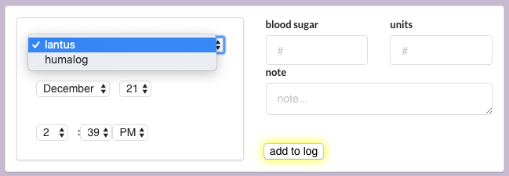

# DiaBase
DiaBase is a dynamic web app built to help insulin dependent diabetics manage their insulin intake by setting a timer every time they administer insulin and tracking previous entries in an organized log.


Backend Ruby on Rails API using Postgres. Endpoints for users, insulins, and entries.

Frontend built with React and Redux (Javascript). Custom CSS styling.

Timers made using Countdown.js. Other datetime data on frontend formatted with date.js and moment.js (when applicable). Datetime data stored in backend using Ruby datetime.

Video demo: https://www.youtube.com/watch?v=CRbWEsMHcQM&t=1s 

## Development Setup

### Backend

Run the rails API in the backend directory on port 3001 with

```bash
bundle install
rails db:create
rails db:migrate
rails s -p 3001
```

### Frontend
To install frontend dependencies run

```bash
npm install
```
To open in browser run

```bash
npm start
```

## Usage Example
After creating an account, a user can add new insulins under settings. An insulin requires a name and a duration in hours (3, 4, 5, 12, or 24 hours). The app calculates how long an entry for a certain type of insulin is active based on the duration of that type of insulin.



As a user, you can create a new entry using the form pictured above. You can enter a type of insulin, date, time, blood sugar, number of units of insulin, and a note. All of these fields are optional, except the type of insulin, so you can just select the insulin from the dropdown menu of your insulins, and click "add to log", and it will record the entry with the current date and time as a default.

You can view your log of previous entries (in reverse chronological order). If the entry is active, it appears green and a timer appears to the left of the log, counting down to when the insulin will be finished acting. You can switch between logs for your different types of insulin. You can delete entries.

Reliable consistent timer updates based on entry end time (entry start time + duration of insulin). Reliable with or without page refresh.

## Contributing
1.  Fork it (https://github.com/rubyreilly/diabase/fork)
2.  Create your feature branch (`git checkout -b feature/fooBar`)
3.  Commit your changes (`git commit -m 'Added fooBar'`)
4.  Push to the branch (`git push origin feature/fooBar`)
5.  Create a new Pull Request

To view previous frontend commits (from before frontend and backend repos were merged), view this repo: https://github.com/rubyreilly/t1dlog_frontend

## Contact

Ruby Reilly – [my github](https://github.com/rubyreilly) – [rubyclaroreilly@gmail.com](mailto:rubyclaroreilly@gmail.com)
