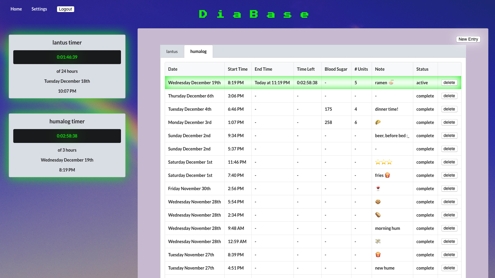

# DiaBase

DiaBase is a dynamic web app built to help type 1 diabetics manage their insulin intake by setting a timer every time they administer insulin and tracking previous entries in an organized log.



Backend:
+ Ruby on Rails
+ API using Postgres with endpoints for users, insulins, and entries
+ Ruby datetime logic

Frontend:
+ React and Redux
+ Custom CSS
+ Date.js, moment.js, and countdown.js

## Development Setup

### Backend

Run the rails API in the backend directory on port 3001 with

```bash
bundle install
rails db:create
rails db:migrate
rails s -p 3001
```

### Frontend
To install frontend dependencies run

```bash
npm install
```
To open in browser run

```bash
npm start
```

## Contributing
1.  Fork it (https://github.com/rubyreilly/diabase/fork)
2.  Create your feature branch (`git checkout -b feature/fooBar`)
3.  Commit your changes (`git commit -m 'Message about your changes'`)
4.  Push to the branch (`git push origin feature/fooBar`)
5.  Create a new Pull Request

## Contact

Ruby Reilly – [my github](https://github.com/rubyreilly) – [rubyclaroreilly@gmail.com](mailto:rubyclaroreilly@gmail.com)
